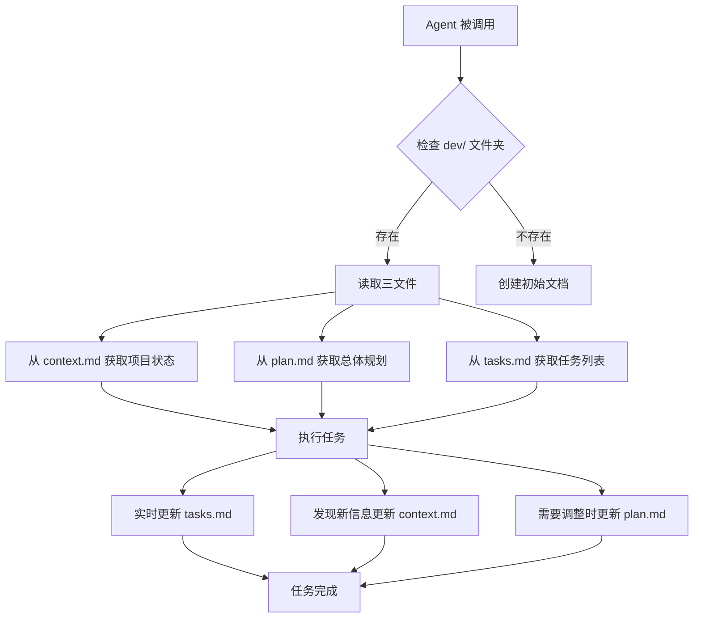

# Agents 与 Dev Docs 集成指南

## 核心机制

Agents 通过 dev 文档系统实现**跨会话状态持久化**和**多 agent 协作**。

### 工作流程



## 具体实现示例

### 示例 1: refactor-planner Agent

```typescript
// agent 初始化时的行为
async function initializeAgent() {
  // 1. 检查 dev 文档是否存在
  const devPath = './dev';
  const hasDevDocs = await fileExists(devPath);

  if (hasDevDocs) {
    // 2. 读取现有上下文
    const context = await readFile(`${devPath}/context.md`);
    const plan = await readFile(`${devPath}/plan.md`);
    const tasks = await readFile(`${devPath}/tasks.md`);

    // 3. 解析并理解当前状态
    const currentState = parseContext(context);
    const refactorPlan = parsePlan(plan);
    const taskList = parseTasks(tasks);

    // 4. 基于现有信息继续工作
    console.log(`继续重构任务: ${taskList.filter(t => !t.completed).length} 个待完成`);
  } else {
    // 5. 创建新的 dev 文档
    await createInitialDevDocs();
  }
}
```

### 示例 2: auth-route-debugger Agent

当 `auth-route-debugger` agent 被调用时：

```typescript
// Step 1: 读取 context.md 了解认证系统
const context = await readFile('./dev/context.md');
// 从 context 中提取：
// - 使用的认证方式 (JWT/Cookie/OAuth)
// - 已知的路由问题
// - 之前的调试历史

// Step 2: 读取 tasks.md 检查相关任务
const tasks = await readFile('./dev/tasks.md');
// 查找相关任务：
// - [ ] 修复 /api/workflow/123 的 401 错误
// - [x] 验证 JWT token 解析逻辑

// Step 3: 执行调试并更新文档
// 发现问题后立即更新 context.md
await appendToFile('./dev/context.md', `
## 认证调试发现 (${new Date().toISOString()})
- 问题：路由注册顺序导致认证中间件未生效
- 影响范围：所有 /api/workflow/* 路由
- 解决方案：调整路由注册顺序
`);

// 更新任务状态
await updateTaskStatus('./dev/tasks.md', 'fix-401-error', 'completed');
```

### 示例 3: documentation-architect Agent

```typescript
// documentation-architect 的特殊行为
async function generateDocs() {
  // 1. 从 context.md 收集所有技术决策
  const context = await readFile('./dev/context.md');
  const technicalDecisions = extractDecisions(context);

  // 2. 从 plan.md 提取架构设计
  const plan = await readFile('./dev/plan.md');
  const architecture = extractArchitecture(plan);

  // 3. 从 tasks.md 生成实施历史
  const tasks = await readFile('./dev/tasks.md');
  const implementationHistory = generateHistory(tasks);

  // 4. 综合生成文档
  const documentation = {
    overview: architecture,
    decisions: technicalDecisions,
    implementation: implementationHistory,
    api: await scanAPIEndpoints(),
    dataFlow: await generateDataFlowDiagram()
  };

  // 5. 写入文档并更新 context
  await writeFile('./documentation/README.md', formatDocs(documentation));
  await appendToFile('./dev/context.md', `
## 文档更新
- 生成时间：${new Date().toISOString()}
- 包含内容：API 文档、数据流图、架构决策记录
- 位置：/documentation/README.md
`);
}
```

## 多 Agent 协作模式

### 场景：复杂重构任务

```typescript
// Agent 1: refactor-planner
// 创建初始计划
await writeFile('./dev/plan.md', `
# 重构计划
## Phase 1: 分析现有代码
- 识别代码坏味道
- 确定重构范围

## Phase 2: 设计新架构
- 组件拆分方案
- 接口定义

## Phase 3: 实施重构
- 逐步迁移
- 保持向后兼容
`);

// Agent 2: code-architecture-reviewer
// 读取计划并审查
const plan = await readFile('./dev/plan.md');
const review = await reviewArchitecture(plan);

// 更新 context 添加审查意见
await appendToFile('./dev/context.md', `
## 架构审查意见
${review.suggestions}
${review.risks}
`);

// Agent 3: code-refactor-master
// 基于计划和审查意见执行
const context = await readFile('./dev/context.md');
const tasks = generateRefactorTasks(plan, context);

// 创建详细任务列表
await writeFile('./dev/tasks.md', formatTasks(tasks));

// 执行重构并实时更新进度
for (const task of tasks) {
  await executeRefactor(task);
  await updateTaskStatus('./dev/tasks.md', task.id, 'completed');
}
```

## Agent 启动模板

每个 agent 都应该遵循这个启动模板：

```typescript
// agent-startup-template.ts
export async function agentStartup(agentName: string) {
  console.log(`[${agentName}] 初始化`);

  // 1. 检查并读取 dev 文档
  const devContext = await loadDevDocs();

  // 2. 分析当前状态
  const state = analyzeState(devContext);
  console.log(`[${agentName}] 当前状态:`, state);

  // 3. 确定工作模式
  const mode = determineMode(state);
  // - 'continue': 继续之前的工作
  // - 'new': 开始新任务
  // - 'collaborate': 与其他 agent 协作

  // 4. 执行任务
  switch (mode) {
    case 'continue':
      await continueWork(devContext);
      break;
    case 'new':
      await startNewWork();
      break;
    case 'collaborate':
      await collaborateWithOthers(devContext);
      break;
  }

  // 5. 保存状态
  await saveDevDocs(devContext);
  console.log(`[${agentName}] 完成`);
}
```

## Dev Docs 文件格式规范

### context.md 格式
```markdown
# 项目上下文

## 技术栈
- 前端：Vue 3 + Element Plus
- 后端：Spring Boot + MyBatis

## 关键决策
### 2024-01-10: 选择 JWT 认证
- 原因：无状态、可扩展
- 实现：cookie 存储、httpOnly

## 已知问题
- [ ] 路由权限检查不一致
- [x] JWT 过期处理

## Agent 执行历史
- 2024-01-10 14:30: auth-route-debugger 修复了认证问题
- 2024-01-10 15:00: refactor-planner 创建了重构计划
```

### plan.md 格式
```markdown
# 实施计划

## 总体目标
将单体应用重构为微服务架构

## 阶段划分
### Phase 1: 服务拆分（当前）
- [ ] 识别服务边界
- [ ] 定义 API 契约
- [x] 创建服务脚手架

### Phase 2: 数据隔离
- [ ] 数据库拆分
- [ ] 实现分布式事务

## 时间线
- Week 1: 完成服务拆分
- Week 2: 实现服务间通信
- Week 3: 部署和测试
```

### tasks.md 格式
```markdown
# 任务列表

## 进行中
- [ ] TASK-001: 实现用户服务 API
  - 负责 Agent: code-refactor-master
  - 开始时间: 2024-01-10 14:00
  - 预计完成: 2024-01-10 18:00

## 已完成
- [x] TASK-000: 创建项目结构
  - 完成 Agent: refactor-planner
  - 完成时间: 2024-01-10 13:00

## 待处理
- [ ] TASK-002: 编写集成测试
- [ ] TASK-003: 更新文档
```

## 实际案例：Agent 链式调用

```bash
# 用户请求
"重构认证系统以支持 OAuth 2.0"

# Agent 执行链
1. refactor-planner → 创建 dev/plan.md
   ↓
2. auth-route-debugger → 分析现有认证，更新 dev/context.md
   ↓
3. code-architecture-reviewer → 审查方案，补充 dev/context.md
   ↓
4. code-refactor-master → 执行重构，更新 dev/tasks.md
   ↓
5. auth-route-tester → 测试新系统，更新验证结果
   ↓
6. documentation-architect → 生成文档，记录到 dev/context.md
```

## 关键优势

1. **断点续传**：Claude Code 重启后，新 agent 可以从 dev docs 恢复状态
2. **并行协作**：多个 agents 可以同时工作，通过 dev docs 共享信息
3. **审计追踪**：所有决策和变更都记录在 dev docs 中
4. **知识积累**：项目知识逐步积累在 context.md 中

## 最佳实践

1. **Agent 启动必读 dev docs**
   ```typescript
   // 每个 agent 的第一步
   const devDocs = await loadDevDocs();
   if (!devDocs) {
     await initializeDevDocs();
   }
   ```

2. **实时更新任务状态**
   ```typescript
   // 任务开始时
   await updateTask(taskId, 'in_progress');
   // 任务完成时
   await updateTask(taskId, 'completed');
   ```

3. **重要发现立即记录**
   ```typescript
   // 发现关键信息
   await appendToContext(`
   ## ${new Date().toISOString()} - ${agentName}
   发现：${discovery}
   影响：${impact}
   建议：${suggestion}
   `);
   ```

4. **协作前检查其他 agent 状态**
   ```typescript
   const activeTasks = await getActiveTasks();
   if (activeTasks.some(t => t.agent !== currentAgent)) {
     console.log('其他 agent 正在工作，协调任务分配...');
   }
   ```