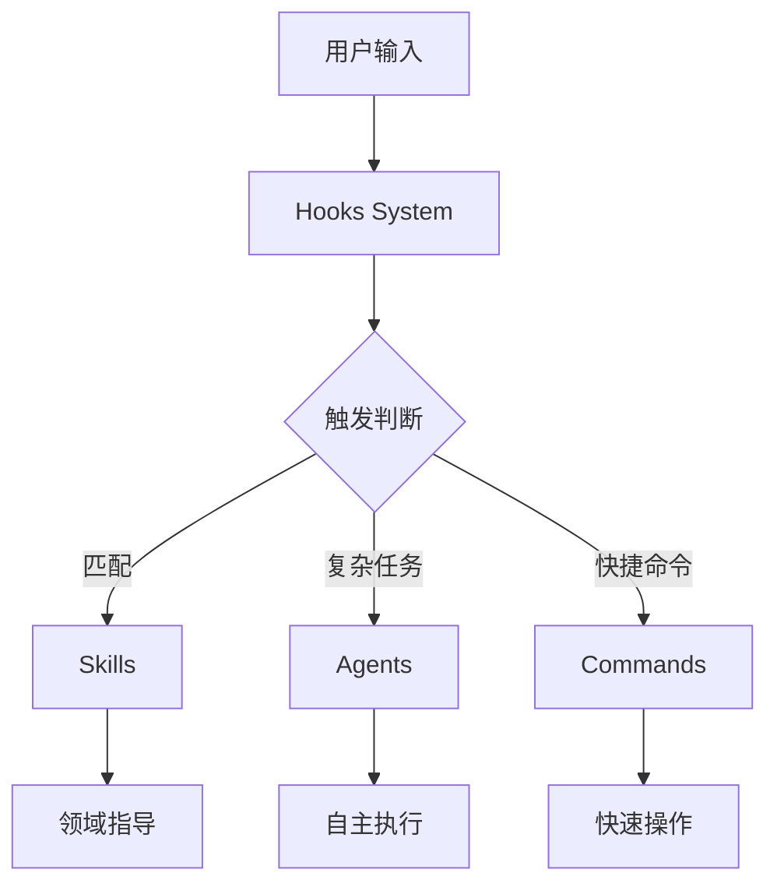

# Claude Code Infrastructure Showcase 项目分析报告

## 执行摘要

**项目名称:** Claude Code Infrastructure Showcase
**项目类型:** Claude Code AI 辅助开发基础设施参考库
**项目状态:** 成熟的参考实现（非可运行应用）
**开发周期:** 6个月的生产环境迭代
**目标用户:** 使用 Claude Code 进行企业级开发的团队

### 核心价值
- 解决了"技能不能自动激活"的行业痛点
- 提供了经过生产验证的 AI 辅助开发基础设施
- 集成时间从6个月缩短到15-30分钟

---

## 一、项目架构概览

### 1.1 项目定位
这不是一个可运行的应用程序，而是一个**参考库**，提供了可复用的 Claude Code 基础设施组件。用户需要将所需组件复制到自己的项目中使用。

### 1.2 架构设计模式

```
claude-code-infrastructure-showcase/
│
├── .claude/                     # 核心基础设施目录
│   ├── settings.json           # Claude Code 配置中心
│   ├── hooks/                  # 钩子系统（自动化触发）
│   ├── skills/                 # 技能系统（领域知识库）
│   ├── agents/                 # 代理系统（自主任务执行）
│   └── commands/               # 命令系统（快捷操作）
│
├── dev/                        # 开发文档
├── README.md                   # 项目说明
├── CLAUDE_INTEGRATION_GUIDE.md # AI集成指南
└── LICENSE                     # MIT许可证
```

### 1.3 核心组件架构



---

## 二、技术栈分析

### 2.1 核心技术
- **编程语言:** TypeScript, JavaScript, Shell Script
- **运行环境:** Node.js (v20+)
- **类型系统:** TypeScript 5.3.3
- **执行器:** tsx 4.7.0

### 2.2 目标技术栈（技能适配）

#### 前端技术栈
- React 18+
- MUI v7 (Material-UI)
- TanStack Query (数据获取)
- TanStack Router (路由管理)
- TypeScript

#### 后端技术栈
- Node.js/Express
- Prisma ORM (数据库访问)
- Sentry (错误追踪)
- Zod (数据验证)
- JWT Cookie-based Auth

### 2.3 技术兼容性
- **技术无关组件:** skill-developer, route-tester, error-tracking
- **技术相关组件:** 需要根据实际项目技术栈进行适配

---

## 三、模块功能分析

### 3.1 Hooks 系统（核心创新）

**问题解决:** Claude Code 默认不会自动激活技能，需要手动调用

**解决方案:** 通过钩子系统实现自动化触发

#### 钩子类型
1. **UserPromptSubmit** - 用户输入时触发
   - skill-activation-prompt.sh/ts
   - 自动分析用户意图并建议相关技能

2. **PostToolUse** - 工具使用后触发
   - post-tool-use-tracker.sh
   - 跟踪编辑操作

3. **Stop** - 会话结束时触发
   - tsc-check.sh - TypeScript 检查
   - trigger-build-resolver.sh - 构建问题解决

### 3.2 Skills 系统（知识管理）

**设计理念:** 500行规则 + 渐进式披露

#### 核心技能
1. **skill-developer** (元技能)
   - 7个资源文件，426行
   - 创建和管理其他技能
   - 包含高级模式库和故障排除指南

2. **backend-dev-guidelines**
   - 12个资源文件
   - 分层架构模式
   - 包含完整的后端开发最佳实践

3. **frontend-dev-guidelines**
   - 11个资源文件
   - React现代模式
   - MUI v7兼容性指导

4. **route-tester**
   - JWT cookie认证测试
   - API路由验证

5. **error-tracking**
   - Sentry集成模式
   - 性能监控配置

### 3.3 Agents 系统（任务执行）

**特点:** 自主运行、专门工具访问、返回综合报告

#### 代理类型（10个）
- **code-architecture-reviewer** - 架构审查
- **code-refactor-master** - 重构执行
- **documentation-architect** - 文档生成
- **frontend-error-fixer** - 前端错误修复
- **plan-reviewer** - 计划审查
- **refactor-planner** - 重构规划
- **auth-route-debugger** - 认证路由调试
- **auth-route-tester** - 路由测试
- **auto-error-resolver** - 自动错误解决
- **web-research-specialist** - 网络研究

### 3.4 Commands 系统（快捷操作）

- **dev-docs** - 开发文档生成
- **dev-docs-update** - 文档更新
- **route-research-for-testing** - 路由测试研究

---

## 四、配置系统分析

### 4.1 主配置文件 (settings.json)

```json
{
  "enableAllProjectMcpServers": true,
  "enabledMcpjsonServers": ["mysql", "sequential-thinking", "playwright"],
  "permissions": {
    "allow": ["Edit:*", "Write:*", "MultiEdit:*", "NotebookEdit:*", "Bash:*"],
    "defaultMode": "acceptEdits"
  },
  "hooks": {
    // 钩子配置
  }
}
```

### 4.2 技能规则配置 (skill-rules.json)

**触发机制:**
- **关键词触发** - keywords
- **意图模式** - intentPatterns
- **文件路径** - pathPatterns
- **内容模式** - contentPatterns

**执行级别:**
- **suggest** - 建议使用
- **block** - 强制使用（guardrail）
- **warn** - 警告但允许继续

---

## 五、代码质量评估

### 5.1 优点
1. **模块化设计** - 组件独立，易于集成
2. **文档完善** - 每个组件都有详细文档
3. **生产验证** - 6个月的实际使用验证
4. **配置灵活** - 支持多种自定义配置
5. **渐进式披露** - 500行规则避免信息过载

### 5.2 设计模式
- **钩子模式** - 事件驱动的自动化
- **技能模式** - 领域知识封装
- **代理模式** - 任务委托执行
- **配置驱动** - 声明式配置

### 5.3 可维护性
- 清晰的目录结构
- 独立的组件设计
- 丰富的示例和文档
- 标准化的命名规范

---

## 六、重构建议

### 6.1 立即可用（无需重构）
✅ 整体架构设计合理
✅ 组件独立性良好
✅ 文档体系完整

### 6.2 集成优化建议

#### 阶段一：基础集成（15分钟）
1. 复制 hooks 系统实现技能自动激活
2. 选择1-2个相关技能进行集成
3. 配置 settings.json

#### 阶段二：定制化（30分钟）
1. 根据项目技术栈调整技能内容
2. 更新 skill-rules.json 的路径模式
3. 自定义触发关键词

#### 阶段三：扩展（按需）
1. 基于模板创建项目专属技能
2. 开发自定义代理
3. 添加项目特定命令

### 6.3 最佳实践建议

1. **技能管理**
   - 遵循500行规则
   - 使用渐进式披露
   - 保持技能独立性

2. **钩子配置**
   - 谨慎使用 block 级别
   - 合理设置触发条件
   - 提供跳过机制

3. **代理使用**
   - 用于复杂多步骤任务
   - 明确输入输出规范
   - 提供详细任务描述

---

## 七、项目特色与创新点

### 7.1 核心创新
1. **自动技能激活** - 解决了行业痛点
2. **500行规则** - 避免AI上下文过载
3. **渐进式披露** - 按需加载知识
4. **生产验证** - 真实项目验证

### 7.2 实用价值
- **时间节省:** 6个月经验浓缩到30分钟集成
- **质量提升:** 生产验证的最佳实践
- **灵活性:** 组件化设计，按需集成
- **可扩展:** 清晰的扩展模式

---

## 八、适用场景

### 8.1 最适合
- 使用 Claude Code 的开发团队
- TypeScript/JavaScript 项目
- 需要 AI 辅助开发规范化的团队
- 希望提高开发效率的项目

### 8.2 需要适配
- 非 JavaScript 技术栈（需要参考模式重写）
- 不使用 Claude Code 的项目
- 简单项目（可能过度工程化）

---

## 九、总结

### 项目评级
- **成熟度:** ⭐⭐⭐⭐⭐ (生产验证)
- **文档质量:** ⭐⭐⭐⭐⭐ (详尽完整)
- **易用性:** ⭐⭐⭐⭐☆ (需要一定学习曲线)
- **灵活性:** ⭐⭐⭐⭐⭐ (高度可定制)
- **创新性:** ⭐⭐⭐⭐⭐ (解决行业痛点)

### 核心价值
这个项目不是一个需要重构的应用，而是一个**成熟的基础设施参考库**。它的价值在于提供了经过生产验证的 Claude Code 使用模式和最佳实践，可以直接复制集成到实际项目中。

### 推荐使用方式
1. **不要整体重构** - 这是参考库，不是应用
2. **选择性集成** - 根据需求选择组件
3. **定制化适配** - 根据项目技术栈调整
4. **渐进式采用** - 先集成核心功能，再扩展

---

## 附录：快速集成检查清单

- [ ] 确认使用 Claude Code
- [ ] 选择需要的组件
- [ ] 检查技术栈兼容性
- [ ] 复制相关文件
- [ ] 更新配置文件
- [ ] 测试自动激活
- [ ] 根据需要定制
- [ ] 文档化集成过程

---

*生成时间: 2025-11-10*
*分析工具: Claude Code with code-index*